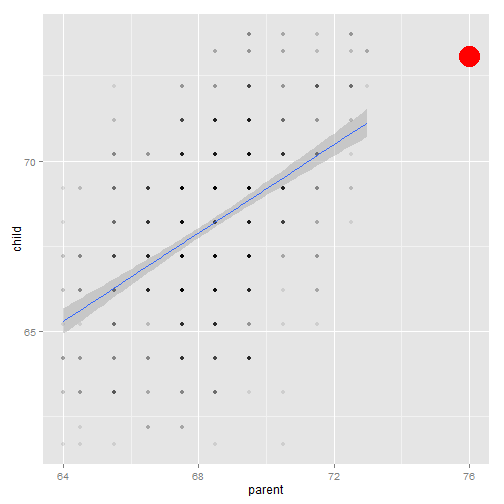

 Predict length of children - Coursera course project
========================================================
author: MBrouns
date: 20-08-2014

Introduction
========================================================


- Course Project for Developing Data Products Course
- Uses Galton dataset 
- User inputs length of both parents and gender of child
- Application calculates expected length of child
- Displays results and plots them

Input
========================================================

- Fathers length in inches (numericInput)
- Mothers length in inches (numericInput)
- Childs gender (selectInput)


```r
# Input code
#
# numericInput('father.height', 'Father length (inches)', 67, min = 10, max = 100, step = 1),
# numericInput('mother.height', 'Mother length (inches)', 67, min = 10, max = 100, step = 1),  
# selectInput('child.gender', 'Childs Gender', c("male","female"), selected = NULL, multiple = FALSE)
```

Calculation
========================================================

- Calculated by linear model fitted on galton datast
- Result divided by 1.08 if the child is female


```r
fit<-lm(child~parent, data=galton)

child.height<-function(father.height,mother.height, child.gender){
  res = as.vector(predict(fit,data.frame(parent=mean(c(father.height,mother.height)))))  
  if(child.gender == "male"){
    res
  }else{
    res/1.08
  }
}
```


Output
========================================================

- Output displayed on plot 
- red circle indicating prediction point

 
