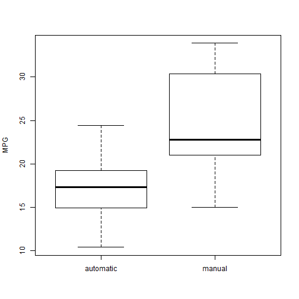
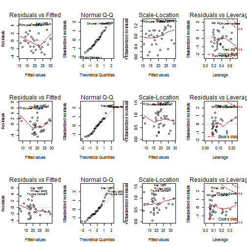

Is driving a stick better for your gas usage.
========================================================

## Executive Summary
This document attempts to answer whether driving a stick or an automatic transmission is better with regards to the fuel efficiency of cars. The used dataset is the mtcars dataset available in R which comes from the 1974 Motor Trend US Magazine. For answering the question, hyphothesis testing and linear models are used to quantify the relationship between transmission and fuel usage. In conclusion it was found that the choice of transmission should be largely made with regards to the weight of the car. For heavier cars, an automatic transmission will be more efficient where for lighter cars a manual transmission will be the optimal choice.

## Exploratory Analysis
As has been mentioned the mtcars dataset will be used for this analysis. The am variable is coded as a factor variable consisting of the values automatic and manual


```r
data(mtcars)
mtcars$am[mtcars$am =="0"] <- "automatic"
mtcars$am[mtcars$am =="1"] <- "manual"
mtcars$am <- as.factor(mtcars$am)
```

An initial exploration of the MPG for the various transmission types shows that the average MPG for automatic transmission is much lower than the MPG for manual cars. 

```r
ya <- mtcars$mpg[mtcars$am == "automatic"]
ym <- mtcars$mpg[mtcars$am == "manual"]
compare <- t.test(x=ym, y=ya, paired=FALSE)
```

A small t-test supports this claim (p-value: 0.0014)


## Regression analysis
For creating a regression model a stepwise algorithm is used. 


```r
model.all <- lm(mpg ~ ., data = mtcars)
model <- step(model.all)
```

```r
model$coef
```

```
## (Intercept)          wt        qsec    ammanual 
##       9.618      -3.917       1.226       2.936
```


This model shows that the weight variable should be strongly considered as a confounding variable. The adjusted r-squared is 0.8336, so we may conclude that more than 83% of the variation is explained by the model.


```r
model.weight <- lm(mpg ~ am + wt, data=mtcars)
```
When creating a model with weight as a confounding variable we get the following results:

```r
model.weight$coef
```

```
## (Intercept)    ammanual          wt 
##    37.32155    -0.02362    -5.35281
```

This model clearly shows that the effect of the transmission is mainly explained by the confounding of the weight variable.

To further explore this variable we add an interaction between the transmission and the weight to the model

```r
model.weightInteraction <- lm(mpg ~ am + wt + am*wt, data=mtcars)
```
The new coefficients from the model with interaction between weight and transmission type are: 

```r
model.weightInteraction$coef
```

```
## (Intercept)    ammanual          wt ammanual:wt 
##      31.416      14.878      -3.786      -5.298
```

A residuals plot (figure 2) clearly shows that the model with interaction gives the best fit. 


```r
anova <- anova(model.all, model.weight,model.weightInteraction)
```

A variance analysis (anova) gives a p value of 0.0577 for the simple weight model vs the standard model and 0.0017 for the interaction model. Therefore we can conclude that there is an interaction which should be taken into account into the model.

## Conclusions
In conclusion we can state that the fuel efficiency of automatic vs manual transmission mostly depends on the weight of the car. The MPG for a manual will be 14.8784 + -5.2984 * (weight) times that of an automatic car. Therefore we conclude that for light cars, manual transmission is preferable while for heavier cars, automatic is best.


## Apendix


```r
boxplot(mtcars$mpg~ mtcars$am, ylab ="MPG")
```

 

Figure 1: MPG for each transmission type


```r
par(mfrow = c(3,4))
plot(model.all)
plot(model.weight)
plot(model.weightInteraction)
```

 
Figure 2: Residual plots for model, model with weight as confounding variable and for model with interaction between weight and transmission
