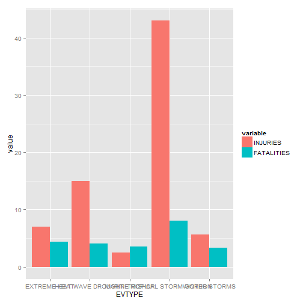

Reproducible Research Peer Assignment 2 - Analysis of severe weather events
========================================================
    
Storms and other severe weather events can cause both public health and economic problems for communities and municipalities. Many severe events can result in fatalities, injuries, and property damage, and preventing such outcomes to the extent possible is a key concern.

This project involves exploring the U.S. National Oceanic and Atmospheric Administration's (NOAA) storm database. This database tracks characteristics of major storms and weather events in the United States, including when and where they occur, as well as estimates of any fatalities, injuries, and property damage.

This research will address two questions:

1. Across the United States, which types of events are most harmful with respect to population health?

2. Across the United States, which types of events have the greatest economic consequences?

# Data processing
This section will go in depth on how the data is processed to make it ready for analysis.
First, the data is read from the supplied csv. Since this read operation can take a long time it is cached so it doesn't have to be executed multiple times.


```r
data <- read.csv("repdata-data-StormData.csv.bz2", header=T)
```

We then check whether there are observations in our data which contain missing values


```r
sum(!complete.cases(data))
```

```
## [1] 902297
```

We can clearly see that none of our observations are complete. This should be taken into account when doing analysis. However, not all columns in the dataset are necessary for answering our questions. When we select a subset of the columns that are relevent we see that there is no missing data and our analysis can continue without imputing being necessary.


```r
dataSubset <- data[c("EVTYPE","FATALITIES","INJURIES","PROPDMG","CROPDMG")]
sum(!complete.cases(dataSubset))
```

```
## [1] 0
```


# Results
The first question was: Across the United States, which types of events are most harmful with respect to population health? To answer this question we will average the number of fatalities and injuries per event type and remove all the entries with 0 fatalities or injuries. We then sort the results in descending order first by fatalities, then by injuries and print out the 5 most harmful events.


```r
aggregatedQ1 <- aggregate(cbind(INJURIES,FATALITIES) ~ EVTYPE, data = dataSubset, FUN = mean)
aggregatedQ1Trimmed <- aggregatedQ1[aggregatedQ1$FATALITIES > 0 & aggregatedQ1$INJURIES > 0, ]
aggregatedQ1Trimmed <- aggregatedQ1Trimmed[with(aggregatedQ1Trimmed, order(-FATALITIES, -INJURIES)), ]

head(aggregatedQ1Trimmed, 5)
```

```
##                    EVTYPE INJURIES FATALITIES
## 851 TROPICAL STORM GORDON   43.000      8.000
## 142          EXTREME HEAT    7.045      4.364
## 279     HEAT WAVE DROUGHT   15.000      4.000
## 487         MARINE MISHAP    2.500      3.500
## 976         WINTER STORMS    5.667      3.333
```

We can also plot these results


```r
library(ggplot2)
library(reshape)
q1melted <- melt(head(aggregatedQ1Trimmed,5), id=c("EVTYPE"))
ggplot(data=q1melted, aes(x=EVTYPE, y=value, fill=variable)) + geom_bar(stat="identity", position=position_dodge())
```

 

The second question was: Across the United States, which types of events have the greatest economic consequences? To answer this question we will average the property and crop damage per event type and remove all the entries with 0 damage. We then sort the results in descending order and print out the 5 most harmful events.


```r
aggregatedQ2 <- aggregate(cbind(PROPDMG,CROPDMG) ~ EVTYPE, data = dataSubset, FUN = mean)
aggregatedQ2$TOTALDMG <- aggregatedQ2$PROPDMG + aggregatedQ2$CROPDMG

aggregatedQ2Trimmed <- aggregatedQ2[aggregatedQ2$TOTALDMG > 0, ]
aggregatedQ2Trimmed <- aggregatedQ2Trimmed[with(aggregatedQ2Trimmed, order(-TOTALDMG)), ]

head(aggregatedQ2Trimmed, 5)
```

```
##                     EVTYPE PROPDMG CROPDMG TOTALDMG
## 851  TROPICAL STORM GORDON     500     500     1000
## 52         COASTAL EROSION     766       0      766
## 291   HEAVY RAIN AND FLOOD     600       0      600
## 589 RIVER AND STREAM FLOOD     600       0      600
## 445              Landslump     570       0      570
```

We can also plot these results


```r
library(ggplot2)
ggplot(data=head(aggregatedQ2Trimmed, 5), aes(x=EVTYPE, y=TOTALDMG)) + geom_bar(stat="identity", position=position_dodge())
```

 
